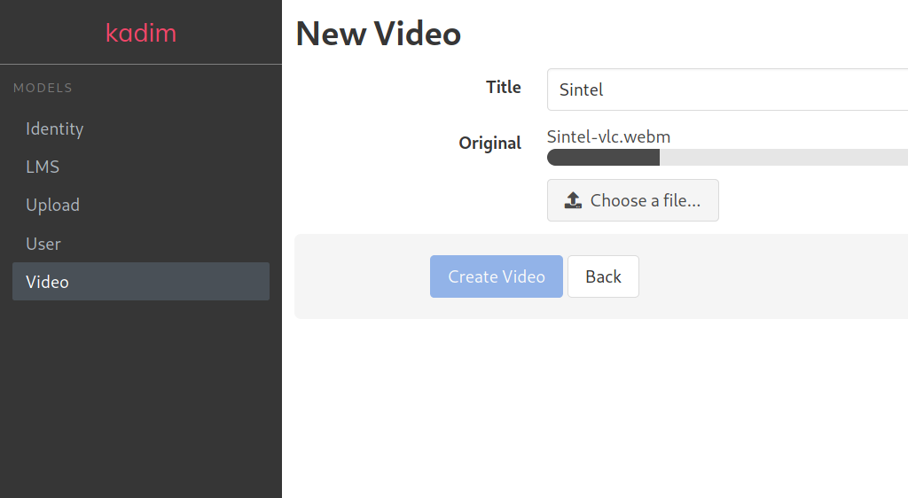

# kadim&#42;
Admin is all about CRUD, right?

My biggest experience with admins is with [RailsAdmin](https://github.com/sferik/rails_admin). I currently work with an
application that makes extensive use of it and all my peers hate having to customize anything on it, me too!

I also tried [administrate](https://github.com/thoughtbot/administrate) and
[trestle](https://github.com/TrestleAdmin/trestle), I think they are a move forward, but reinventing the wheel is super
cool, right? The true is that I want more Rails and less DSL.

*&#42;kadim: derived from "cadim", an expression from the brazillian mineiro dialect that means "a little bit".*

## Usage
In the current incarnation, it's very crud (no pun intended). We just dynamically scaffold_controller your models using
all it's attributes and ActiveStorage relations inside `tmp/kadim` and load everything in memory, including views. This
allows you to run kadim in environments with ephemeral file systems, like [heroku](https://www.heroku.com/).

Just follow the [Installation](#installation) section and access http://localhost:3000/kadim

### [bulma.io](https://bulma.io) layout
If you want a more beautiful view, add the following to your configuration file:

```ruby
# config/initializers/kadim.rb
Kadim.configure do |config|
  config.layout = :bulma
end
```



### ActiveStorage support
If we detect that you have S3, GCS or Azure Storage configured we will use
[Direct Uploads](https://edgeguides.rubyonrails.org/active_storage_overview.html#direct-uploads) by default. If you are
using GCS and uploading biiiig files, the `resumable` option is perfect:

```ruby
# config/initializers/kadim.rb
Kadim.configure do |config|
  config.upload_type = :resumable
end
```

upload_type accepts the following options:
  - :local     - Uses ActiveStorage [Disk Service](https://edgeguides.rubyonrails.org/active_storage_overview.html#disk-service)
  - :direct    - Uses ActiveStorage [Direct Upload](https://edgeguides.rubyonrails.org/active_storage_overview.html#direct-uploads)
  - :resumable - Uses [activestorage-resumable gem](https://rubygems.org/gems/activestorage-resumable) to implement [Resumable Uploads](https://cloud.google.com/storage/docs/performing-resumable-uploads) (supports only GCS)

## Customization / generators

### kadim:host

Usage: `rails g kadim:host`

Hosts the base files of kadim inside your application, allowing you to customize from the base controller to the
layouts with the Ruby on Rails you know and love.

The following folders will be copied recursively to your application:
  - app/assets/javascripts/kadim
  - app/assets/stylesheets/kadim
  - app/controllers/kadim
  - app/helpers/kadim
  - app/views/kadim
  - app/views/layouts/kadim

It's pretty simple stuff, just take a look: https://github.com/fnix/kadim/tree/master/app

### kadim:scaffold_controller

Usage: `rails g kadim:scaffold_controller NAME [field:type field:type] [options]`

Hosts on your application the files generated in runtime by `kadim` for the giving resource. This generator is a thin
layer over the Rails scaffold_controller and accepts the same arguments.

For example, using `credit_card` for NAME, the following files wil be generated on your application:
  - Controller: app/controllers/kadim/credit_cards_controller.rb
  - Test:       test/controllers/kadim/credit_cards_controller_test.rb
  - Views:      app/views/kadim/credit_cards/index.html.erb [...]
  - Helper:     app/helpers/kadim/credit_cards_helper.rb

## Installation
Add this line to your application's Gemfile:

```ruby
gem 'kadim'
```

And then execute:
```bash
$ bundle
```

Or install it yourself as:
```bash
$ gem install kadim
```

Mount the engine (add to routes.rb):
```ruby
mount Kadim::Engine, at: '/kadim'
```

And access http://localhost:3000/kadim

## Roadmap
- [x] Dynamic CRUD generation from application models
- [x] Tasks to copy files form kadim to the hosted application
- [x] Add support to ActiveStorage attachments
- [ ] Add support to belongs_to relationships
- [x] Add a beautiful look and feel

## License
The gem is available as open source under the terms of the [MIT License](https://opensource.org/licenses/MIT).
